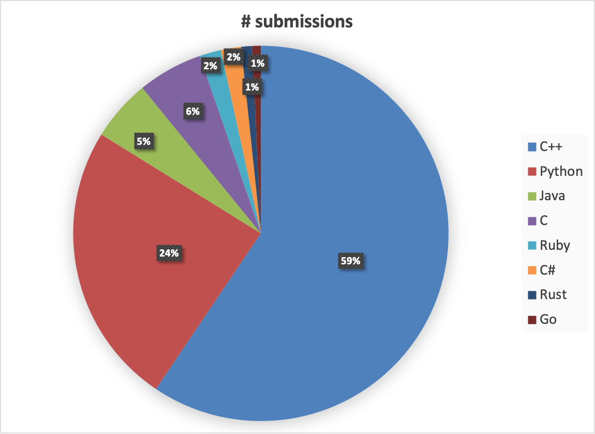
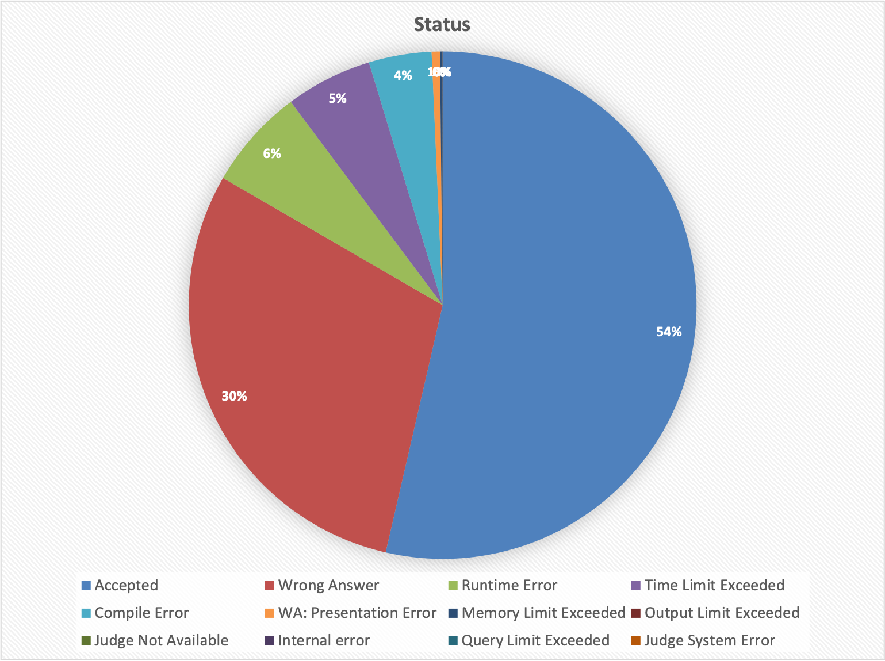

# Project CodeNet

[](https://zenodo.org/badge/latestdoi/363800912)

The goal of Project CodeNet is to provide the *AI-for-Code* research community with a large scale, diverse, and high quality curated dataset to drive innovation in AI techniques. 

## Table of Contents

   * [Introduction](#introduction)
      * [Differentiation](#differentiation)
      * [Benchmarks](#benchmarks)
      * [Potential use cases](#potential-use-cases)
      * [Usability](#usability)
   * [Models and experiments](#models-and-experiments)
   * [Relevant links](#relevant-links)
   * [Download the dataset](#download-the-dataset)
   * [Dataset overview](#dataset-overview)
      * [Dataset statistics](#dataset-statistics)
   * [Data](#data)
   * [Metadata](#metadata)
      * [Metadata at the dataset level](#metadata-at-the-dataset-level)
      * [Metadata at the problem level](#metadata-at-the-problem-level)
   * [Directory structure and naming convention](#directory-structure-and-naming-convention)
   * [Relationships among the metadata and data](#relationships-among-the-metadata-and-data)
      * [Example of getting the source file for a particular submission](#example-of-getting-the-source-file-for-a-particular-submission)
      * [Example of getting the metadata for a particular source file](#example-of-getting-the-metadata-for-a-particular-source-file)
   * [Tools to process source files](#tools-to-process-source-files)
      * [Statistics](#statistics)
      * [Access and selection](#access-and-selection)
      * [Pre-processing](#pre-processing)
   * [Contributors](#contributors)

## Introduction

A decade ago, Marc Andreessen [famously wrote](https://a16z.com/2011/08/20/why-software-is-eating-the-world/) that "software is eating the world." Software now permeates every part of our existence; Google services combine for [2 billion lines of code](https://www.wired.com/2015/09/google-2-billion-lines-codeand-one-place/), and a modern vehicle [contains around](https://www.technologyreview.com/2012/12/03/181350/many-cars-have-a-hundred-million-lines-of-code/) 100 million lines of code. It's a monumental challenge to create, debug, maintain, and update these complex software systems. Recently, a fast-growing discipline known as AI for Code aims to help software developers improve their productivity by automating the software engineering process. AI for Code researchers have been leveraging technologies like NLP and augmenting them with code analysis and compilation techniques to perform a myriad of practical tasks, such as code search, summarization, and completion, as well as code-to-code translation. The discipline isn't limited to academic research either: Ruchir Puri, IBM Research's chief research scientist, discussed in a recent [podcast](https://open.spotify.com/episode/7gHPbVBHEgSdrACTow7Gql) how technologies from AI for Code are being used to modernize legacy software by helping migrate monolithic applications to microservices for IBM's enterprise clients.

AI for Code is poised to transition from proof-of-concept to widespread adoption. To provide a catalyst for such a tipping point, researchers at IBM Research have introduced Project CodeNet, a large-scale dataset for benchmarking and experimentation. Project CodeNet has many characteristics (large scale, diveristy, etc.) similar to ImageNet, a huge dataset for imagery that had a dramatic impact on the field of computer vision research. Project CodeNet is a large scale dataset with approximately 14 million code samples, each of which is an intended solution to one of 4000 coding problems. Project CodeNet aims to do for AI for Code what ImageNet did for computer vision.

### Differentiation

There are a few differentiating features of Project CodeNet when compared to other similar efforts. In addition to the size of the dataset, the code samples are written in over 50 programming languages, though the dominant languages are C++, C, Python, and Java. The code samples in Project CodeNet are annotated with a rich set of information, such as the code size, memory footprint, CPU run time, and status, which indicates acceptance or error types. Over 90% of the problems come with the respective problem description, which contains a concise problem statement, specification of the input format and the output format. When available, we also extracted from the problem description sample input and output, and provide them as part of the dataset. Users can execute the accepted codes samples (over 50% of the submissions are accepted) to extract additional metadata and verify outputs from generative AI models for correctness.

Another area that Project CodeNet addressed is the quality of the data samples. From a [paper](https://arxiv.org/pdf/1812.06469.pdf) by Allamanis, we learned that quite a large number of frequently used AI for Code datasets have duplicate or near-duplicate code samples, which can inflate performance metrics as much as 100%. In addition, we found that problem-submission style datasets from online judging systems can contain clusters of identical problems, which will certainly skew the performance metrics. One example is [POJ-104](https://sites.google.com/site/treebasedcnn/), in which problems 26 and 62 are identical. Therefore we identified the near-duplicates and the identical problem clusters in Project CodeNet and provide these information for the benefit of the users.

### Benchmarks

In light of these issues, we have extracted several benchmark datasets from CodeNet for users to perform code classification and code similarity experiments. They have been filtered to remove identical problem clusters and near-duplicate code samples, so that performance metrics can be measured on training and test data samples with the appropriate statistics. There are two C++ benchmark datasets that are similar to the popular POJ-104 but are approximately ten times in size. We felt that the size increase is necessary, since [98% accuracy](https://github.com/zhangj111/astnn) has been already achieved in code classification on POJ-104. An order of magnitude larger dataset will leave ample room to advance the state of the art with more complex neural networks and algorithms. The other two benchmark datasets are in Python and Java, which provides a different flavor because the frequent use of library functions.

### Potential use cases

The rich metadata and diversity open Project CodeNet to a plethora of uses cases. The problem-submission relationship in Project CodeNet corresponds to [type-4 similarity](https://escholarship.org/uc/item/45r2308g) and can be used for code search and clone detection. The code samples in Project CodeNet are labeled with their acceptance status and we can explore AI techniques to distinguish correct codes from problematic ones. Project CodeNet's metadata also enables the tracking of how a submission evolves from problematic to accepted, which could be used for exploring automatic code correction. Each code sample is labeled with CPU run time and  memory footprint, which can be used for regression studies and prediction. Given  its wealth of programs written in a multitude of languages, Project CodeNet may serve as a valuable benchmark dataset for source-to-source translation.

### Usability

To facilitate creation of customized benchmarks and dataset, we provide a set of productivity tools to aggregate codes samples based on user criteria. We are also releasing pre-processing tools to transform code samples into [token sequences](tools/tokenizer), [simplified parse trees](tools/spt-generator) and other [code graphs](tools/analysis-graph-generator).

## Models and experiments

We have performed numerous experiments on the CodeNet dataset. The goal of these experiments is to produce a set of baseline models and results for users of the CodeNet dataset to gauge their research. The run scripts and training scripts are available in the model-experiments directory. The classification and similarity experiments use the benchmark datasets we extracted from CodeNet as training and test datasets. In addition to experiments based on token sequences, we also have experiments leveraging graph neural networks (GNN). For the convenience of the users interested in GNN's, we have included the simplified parse tree (SPT) representation of the code samples for each benchmark dataset. The experiment on Masked Language Model has a companion Jupyter notebook in the notebooks directory.

## Problem Descriptions

For the vast majority of problem classes, short problem descriptions are available in
'doc/problem_descriptions.tar.gz', a small html file for each problem. 

## Relevant links

- [Project CodeNet full dataset: Project_CodeNet.tar.gz](https://codait-cos-dax.s3.us.cloud-object-storage.appdomain.cloud/dax-project-codenet/1.0.0/Project_CodeNet.tar.gz)
- [Project CodeNet metadata: Project_CodeNet_metadata.tar.gz](https://dax-cdn.cdn.appdomain.cloud/dax-project-codenet/1.0.0/Project_CodeNet_metadata.tar.gz). Unfortunately this dataset is no longer available as a separate tar file;
It does however form part of the full dataset listed above.
- [Project CodeNet paper: Arxiv paper](https://arxiv.org/abs/2105.12655)

## Download the dataset

Download the full dataset from the link listed above, then use

`tar -zxf Project_CodeNet.tar.gz`
to uncompress and untar. The directory structure and how the code samples are organized are explained [here](README.md#directory-structure-and-naming-convention).

The 4 benchmark datasets, Project_CodeNet_C++1000, Project_CodeNet_C++1400,
Project_CodeNet_Python800, and Project_CodeNet_Java250 are included in the
full dataset.
They can be used for code classification and code similarity research as a replacement of or in addition to the dataset [POJ-104](https://sites.google.com/site/treebasedcnn/).

To expedite AI for code research using graph neural networks, we have included the simplified parse tree (SPT) representation of the code samples for each benchmark dataset. They are available in the "Archive SPT File" column of the table in the "Get this Dataset" section in our [data repository](https://developer.ibm.com/exchanges/data/all/project-codenet/).

## Dataset overview

The Project CodeNet Dataset consists of a very large collection of source files, extensive metadata, tooling to access the dataset and make tailored selections, and documentation.

The basis of the dataset is the data available on two online judge web sites:

1. [AIZU Online Judge](https://onlinejudge.u-aizu.ac.jp/home)
2. [AtCoder](https://atcoder.jp/)

An online judge website offers programmers an opportunity to test their skills by posing programming problems in the form of courses or contests. Users may submit their solution which is then judged by an automatic review mechanism. The outcome is reported back to the user. Both problem descriptions, user submissions and associated metadata are available for study via various REST APIs.

The first step in constructing Project CodeNet is downloading the problem descriptions and the source code submissions from the websites mentioned above, followed by reshaping and consolidating the metadata and cleaning up the inconsistencies, omissions, and
mistakes in the source data itself.

### Dataset statistics

The dataset comprises 13,916,868 submissions, divided into 4053 problems (of which 5 are empty). Of the submissions 53.6% (7,460,588) are *accepted*, 29.5% are marked as *wrong answer* and the remaining suffer from one of the possible rejection causes. The data contains submissions in 55 different languages, although 95% of them are coded in the six most common languages (C++, Python, Java, C, Ruby, C#). C++ is the most common language with 8,008,527 submissions (57% of the total) of which 4,353,049 are *accepted*. Here are 2 pie charts depicting submissions and status distribution of Project CodeNet.

<table><tr>
<td>  </td>
<td>  </td>
</tr></table>

A detailed overview of the dataset statistics can be found in this [spreadsheet](assets/Project_CodeNet_statistics.xlsx).

## Data

The data consist of complete programs in a particular programming language. Each program is contained in a single file. The file will have a name with an extension that denotes the programming language used. (More details about the specific programming language and the version of the compiler/interpreter used, can be found in the metadata.)

Each program attempts to solve a certain programming task or problem. There are many problems and each problem might have many solutions in different languages. We refer to each program as a submission instead of a solution since it might not be complete and correct.  Solutions are the accepted submissions that are compilable and executable, and at least correctly produce the expected results on all provided test cases. (Of course, according to the late Dijkstra, tests are no proof of correctness.)

## Metadata

The metadata provides properties of interest about the problems and their submissions. Foremost it formalizes the organization of the data and the relationship between problems, languages, and the source code files. The metadata allows for queries about the data and to make specific selections among the large collection of problems, languages, and source files.

Metadata is made available in comma-separated value (CSV) files. This allows for easy processing, even with simple command-line tools. Some of the fields in the csv files might be empty, and for submissions that are not accepted, some fields might have invalid entries such as negative numbers for CPU time. Extra checking needs to be implemented in parsing these files.

The metadata is hierarchically organized on 2 levels: the first level is the dataset level that relates to all the different problems defined by the various dataset sources. The second level is the problem level that relates to all source code submissions pertaining to a single problem or task.

Metadata and data are deliberately kept fully separated within the file system.

### Metadata at the dataset level

At the dataset level there is a single CSV file (`problem_list.csv`) listing all the different problems. Additionally, for each problem there is a more extensive description that sets the problem and any further requirements and constraints and often provides examples of data input and expected output.

The fields and their format of this CSV file are captured by the following table:

name of column | data type | unit | description
-- | -- | -- | --
id           | string | none | unique anonymized id of the problem
name         | string | none | short name of the problem
dataset      | string | none | original dataset, AIZU or AtCoder
time_limit   | int    | millisecond | maximum time allowed for a submission
memory_limit | int    | KB | maximum memory allowed for a submission
rating       | int    | none | rating, i.e., difficulty of the problem
tags         | string | none | list of tags separated by "\|"; not used
complexity   | string | none | degree of difficulty of the problem; not used

### Metadata at the problem level

At the problem level there is a CSV file per problem and all content of these files is of course organized under one and the same header.

The fields and their format of this CSV file are captured by the following table:

name of column | data type | unit | description
-- | -- | -- | --
submission_id | string | none | unique anonymized id of the submission
problem_id    | string | none | anonymized id of the problem
user_id       | string | none | anonymized user id of the submission
date          | int    | seconds | date and time of submission in the Unix timestamp format (seconds since the epoch)
language      | string | none | mapped language of the submission (ex: C++14 -> C++)
original_language | string | none | original language specification
filename_ext  | string | none | extension of the filename that indicates the programming language used
status        | string | none | acceptance status, or error type
cpu_time      | int    | millisecond | execution time
memory        | int    | KB | memory used
code_size     | int    | bytes | size of the submission source code in bytes
accuracy      | string | none | number of tests passed; *Only for AIZU

Here is a table of all the possible status values. The “abbreviation” and “numeric code” are sometimes seen in the original metadata on the websites; it is listed here for reference and completeness. These fields do not occur in the Project CodeNet metadata.

status | abbreviation | numeric code
-- | -- | --
Compile Error          | CE  |  0
Wrong Answer           | WA  |  1
Time Limit Exceeded    | TLE |  2
Memory Limit Exceeded  | MLE |  3
Accepted               | AC  |  4
Judge Not Available    | JNA |  5
Output Limit Exceeded  | OLE |  6
Runtime Error          | RE  |  7
WA: Presentation Error | PE  |  8
Waiting for Judging    | WJ  | 
Waiting for Re-judging | WR  | 
Internal Error         | IE  | 
Judge System Error     |     | 

## Directory structure and naming convention

The data and metadata are organized in a rigorous directory structure. At the top level sits the `Project CodeNet` directory with several sub-directories, `data`, `metadata`, and `problem_descriptions`:

- `data` is further subdivided into a directory per problem and within each problem directory, directories for each language. The language directory contains all the source files supposed to be written in that particular programming or scripting language. When there are no submissions for a particular language, there will be no directory for it, but the problem directory will always be there, even if there are no submissions at all.

    The name of the directory for a programming language is the common name for the language using proper capitalization and special characters. This name is the consolidation of the names used in the metadata. Information is available about how the original language designations are mapped into the directory names and how these more general and common names are mapped to the submission file name extensions. As an example, a source could be designated c++14, which is mapped into the directory `C++` (notice the capital C) and will get the extension `.cpp`.
- `derived` holds information about near-duplicates, identical problem clusters, sample input and output for each problem, as well as the benchmarks. 
- `metadata` holds all the problem CSV files and the `problem_list.csv` file.
- `problem_descriptions` holds HTML files for most problems, giving an extensive description of the problem, often accompanied with some sample input and expected output.

For the sake of creating a uniform set of metadata across all data sources, and to hide any sensitive information, some metadata fields are anonymized by randomly (but uniquely and consistently) renumbering problem, submission, and user identifiers (ids). The identifiers we use are defined by simple regular expressions:

- problem ids are anonymized and follow this pattern: `p[0-9]{5}` (a `p` followed by exactly 5 digits).
- submission ids are anonymized and follow this pattern: `s[0-9]{9}` (an `s` followed by exactly 9 digits).
- user ids are anonymized and follow this pattern: `u[0-9]{9}` (a `u` followed by exactly 9 digits).

## Relationships among the metadata and data

The main relationship between problem metadata and data is the fact that each metadata record (a non-header row in a problem CSV file) describes one source file and provides all information about its location. The directory structure and naming convention as stated above are implicitly assumed.

### Example of getting the source file for a particular submission

Starting at a CSV metadata entry for a particular submission, here is how to get to the corresponding source file. Say that the submission id is `s300682070`. Either we know this is a submission to problem `p00001` upfront or we can grep through all `Project_CodeNet/metadata/p?????.csv` files to learn that. We get a brief description of this problem by looking at the `p00001` entry in the `Project_CodeNet/metadata/problem_list.csv`:

```console
p00001,List of Top 3 Hills,AIZU,1000,131072,,,
```

We can get a more verbose description of this problem by reading `Project_CodeNet/problem_descriptions/p00001.html`.

The `Project_CodeNet/metadata/p00001.csv` file provides the info on all submissions. For our selected submission we find:

```console
s300682070,p00001,u558442027,1480319506,JavaScript,JavaScript,js,Accepted,60,15496,219,4/4
```

We see it is an `Accepted` submission in the language `JavaScript` with file extension `.js`.

The source file path therefore is: `Project_CodeNet/data/p00001/JavaScript/s300682070.js`

### Example of getting the metadata for a particular source file

Likewise, we can play the reverse game of finding the metadata entry for a given submission source file. Say the source file is `Project_CodeNet/data/p00001/JavaScript/s300682070.js`.

Encoded in this file name path we see the problem id `p00001` and language `JavaScript` and of course the submission id `s300682070`. We find the metadata CSV file to be: `Project_CodeNet/metadata/p00001.csv`. Opening that file and searching for the submission id we find the entry:

```console
s300682070,p00001,u558442027,1480319506,JavaScript,JavaScript,js,Accepted,60,15496,219,4/4
```

## Tools to process source files

The source files of Project CodeNet represent examples of some 50+ different programming and scripting languages. Of course not all languages are equally represented: most submissions are written in the more popular languages C, C++, Java, and Python.

To complement our large dataset of source code, a suite of tools and utilities will be provided. These tools target several purposes:

- derive statistics from the dataset
- access the dataset files to make selections
- preprocess the source files to extract certain information
- facilitate conversions between popular formats

### Statistics

Since Project CodeNet uses the file system as storage and uses a rigorous directory structure, many (Linux) command-line utilities can be directly used to extract interesting statistics about the dataset. Utilities like `ls`, `wc` and `grep` are very useful. The CSV metadata can best be browsed using [`csvkit`](https://csvkit.readthedocs.io/en/latest/) components like `csvstat`.

More elaborate statistics about the dataset can easily be retrieved using SQL queries on a database representation of the metadata. [HSQLDB](http://hsqldb.org/) is a database that runs off a CSV file. Our CSV problem metadata files are simply stripped of their headers and concatenated. A suite of useful SQL queries is available. A separate [document](doc/HSQLDB.md) explains the necessary steps.

### Access and selection

As described above, it should be easy to create specific subsets of the
dataset merely by copying (or symlinking) relevant files and/or
directories. For more elaborate selections based on a subset or range of
problems, a subset of languages, statuses, and code sizes, several Bash
scripts are available to accomplish that. These scripts reside in the
`tools/aggregation-scripts` directory and are separately documented in this [README](tools/aggregation-scripts/README.md).

### Pre-processing

We provide tools to convert code samples into a representation that can be consumed by AI algorithms
  - generate stream of tokens [tokenizer](tools/tokenizer)
  - parsing to tree/abstract syntax tree [AST generation](tools/spt-generator) 
  - control and data flow graph construction [code analysis](tools/analysis-graph-generator) 

Whether and to what extent the above steps can successfully be applied to any given source file depends on several factors. Obviously, if the submission is not of `Accepted` status, it is to be expected that even simple tokenization will fail because of malformed lexical elements. But the situation for `Accepted` submissions is not always better: programmers might have used certain non-standard features of the language that happen to be accepted by a certain compiler or interpreter. Simple cases are the use of a dollar sign as part of a C identifier. For languages like C and C++ that use a pre-processor, use of macros and conditional defines can hugely change how the code ultimately looks like.

### Contributors

Ruchir Puri, David S. Kung, Geert Janssen, Wei Zhang, Giacomo Domeniconi, Vladimir Zolotov, Julian Dolby, Jie Chen, Mihir Choudhury, Lindsey Decker, Veronika Thost, Luca Buratti, Saurabh Pujar, Shyam Ramji, Ulrich Finkler, Susan Malaika, Frederick Reiss.
