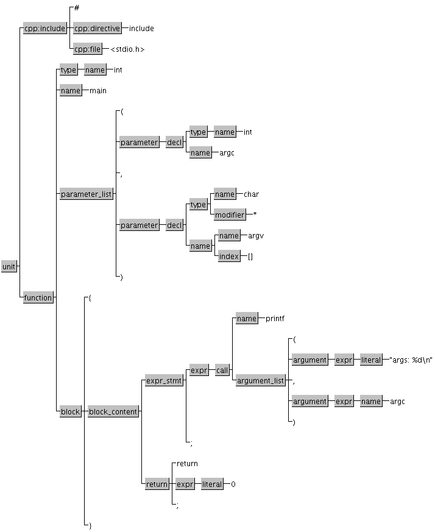

# Some Experiments using the srcML Tool

## Introduction

[srcML](https://www.srcml.org) is a tool for the analysis of programming
language source code.
It is unique in that it presents its results in the form of an annotation
(using XML elements and attributes) of the original source code in a lossless
manner. Like in compression, lossless here means that the original source code
can be fully retrieved, inclusive lay-out in the form of white-space
and indentation.

The provided annotation reflects a simple Abstract Syntax Tree (AST) of the
"program". The program need not necessarily be a complete program in the sense
of the syntax of the programming language; it might as well be a well-formed
code snippet, like a declaration, a function definition, or a block of
statements, or an expression. Unlike with other parsers that would need to
know a grammar start symbol, with srcML there is no need to make this known:
srcML will figure out by itself how to process the snippet.
The programming languages supported by srcML are: C, C++, C#,
and Java. Each language has its own unique XML elements together with a common
shared set for similar language constructs.
This is documented [here](https://www.srcml.org/doc/srcMLGrammar.html).

### Example

The XML annotation is demonstrated here with a tiny C source code example:

[tiny.c]
```C
#include <stdio.h>

int main(int argc, char *argv[]) {
  printf("args: %d\n", argc);
  return 0;
}
```

The following command turns the C code into the annotated XML:
```console
$ srcml tiny.c -o tiny.xml
```

This generates the following XML. Mind that we manually edited the result
so that it fits on the page in this document without truncation of long lines.
(Of course this destroys the preserved lay-out of the original C source.)

```xml
<?xml version="1.0" encoding="UTF-8" standalone="yes"?>
<unit xmlns="http://www.srcML.org/srcML/src"
	  xmlns:cpp="http://www.srcML.org/srcML/cpp"
	  revision="0.9.5" language="C" filename="tiny.c">
  <cpp:include>#<cpp:directive>include</cpp:directive>
    <cpp:file>&lt;stdio.h&gt;</cpp:file>
  </cpp:include>

<function><type><name>int</name></type> <name>main</name>
  <parameter_list>(<parameter><decl><type><name>int</name></type>
    <name>argc</name></decl></parameter>,
	<parameter><decl><type><name>char</name> <modifier>*</modifier></type>
	<name><name>argv</name><index>[]</index></name></decl></parameter>
  )</parameter_list>

<block>{
  <expr_stmt><expr><call><name>printf</name>
    <argument_list>(
	<argument><expr><literal type="string">"args: %d\n"</literal></expr>
	</argument>,
	<argument><expr><name>argc</name></expr></argument>
	)</argument_list></call></expr>;</expr_stmt>
  <return>return <expr><literal type="number">0</literal></expr>;</return>
}</block></function>
</unit>
```

To restore the original C code, run this:
```console
$ srcml tiny.xml
```

To remove the enclosing `<unit>` element use the `--output-srcml-inner` option.
To render the output XML in a nicely formatted form you can use this filter:
`| tidy -xml -i -q -`.
(Obviously you will lose the original white-space lay-out.)

There are various tools to render the parse tree as an image. A simple one is
DrawTag that accept any XML as input.
See figure 1 for a visualization of the tiny.xml file.



The srcML program has many options:

```console
GENERAL OPTIONS:
  -h [ --help ] arg                 display this help and exit. USAGE: help or 
                                    help [module name]. MODULES: src2srcml, 
                                    srcml2src
  -V [ --version ]                  display version number and exit
  -v [ --verbose ]                  conversion and status information to stderr
  -q [ --quiet ]                    suppress status messages
  --list                            list all files in the srcML archive and 
                                    exit
  -i [ --info ]                     display most metadata except srcML file 
                                    count and exit
  -L [ --longinfo ]                 display all metadata including srcML file 
                                    count and exit
  --max-threads arg (=4)            set the maximum number of threads srcml can
                                    spawn
  -o [ --output ] arg (=stdout://-) write ouput to a file


CREATING SRCML:
  -l [ --language ] arg               set the language to C, C++, or Java
  --register-ext arg                  register file extension EXT for 
                                      source-code language LANG. arg format 
                                      EXT=LANG
  --src-encoding arg                  set the input source encoding
  --files-from arg                    read list of source file names to form a 
                                      srcML archive
  -X [ --output-xml ]                 output in XML instead of text
  -r [ --archive ]                    store output in a srcML archive, default 
                                      for multiple input files
  --in-order                          enable strict output ordering
  -t [ --text ] arg                   raw string text to be processed

MARKUP OPTIONS:
  --position                          include line/column attributes, namespace
                                      'http://www.srcML.org/srcML/position'
  --tabs [=arg(=8)]                   set tabs arg characters apart.  Default 
                                      is 8
  --cpp                               enable preprocessor parsing and markup 
                                      for Java and non-C/C++ languages
  --cpp-markup-if0                    markup cpp #if 0 regions
  --cpp-nomarkup-else                 leave cpp #else regions as text

XML FORM:
  -x [ --xml-encoding ] arg (=UTF-8)  set output XML encoding. Default is UTF-8
  --no-xml-declaration                do not output the XML declaration
  --no-namespace-decl                 do not output any namespace declarations
  --xmlns arg                         set the default namespace to arg
  --xmlns: arg                        set the namespace. arg format PREFIX=URI

METADATA OPTIONS:
  -f [ --filename ] arg               set the filename attribute
  --url arg                           set the url attribute
  -s [ --src-version ] arg            set the version attribute
  --hash                              add hash to srcml output
  --timestamp                         add timestamp to srcml output
  -p [ --prefix ] arg                 display prefix of namespace given by URI 
                                      arg and exit
  --show-language                     display source language and exit
  --show-url                          display source url name and exit
  --show-filename                     display source filename and exit
  --show-src-version                  display source version and exit
  --show-timestamp                    display timestamp and exit
  --show-hash                         display hash and exit
  --show-encoding                     display xml encoding and exit
  --show-unit-count                   display number of srcML files and exit


EXTRACTING SOURCE CODE:
  -S [ --output-src ]    output in text instead of XML
  --to-dir arg           extract all files from srcML and create them in the 
                         filesystem

TRANSFORMATIONS:
  --apply-root           apply an xslt program or xpath query to the root 
                         element
  --relaxng arg          output individual units that match RELAXNG file or URI
  --xpath arg            apply XPATH expression to each individual unit
  --xslt arg             apply XSLT file or URI transformation to each 
                         individual unit
  --attribute arg        add attribute to xpath query
  --element arg          add element to xpath query
  -U [ --unit ] arg      extract individual unit number from srcML
```

For instance, the XML markup can be enhanced with line and column coordinates.
Notice also that srcML has built-in capabilities to query and manipulate the
XML. Queries can be done with XPath expressions. General transformations can
be executed with XSLT. By the way, there is no need to first convert the
source to XML; the built-in queries capabilities work also directly off the
source code.

Here are a few examples of useful operations:

- Get all function and method definition names:
```console
$ srcml --xpath="//src:function/src:name" program.java
```

- Count the number of conditions:
```console
$ srcml --xpath='count(//src:condition)' program.c
```

- Output all line comments:
```console
$ srcml --xpath='//src:comment[@type="line"]' program.cpp
```

Much more versatile and powerful tools to process any XML are
[`xidel`](http://videlibri.sourceforge.net/xidel.html) and
[`xmlstarlet`](http://xmlstar.sourceforge.net/).

If you prefer JSON over XML, then use `jtm` to convert the srcML output:

```console
jtm -i2 tiny.xml > tiny.json
```

## Using srcML to extract a Function Call Graph

A neat application of the combination of srcML and xmlstarlet is to use
them in a script to produce the call graph of a program as a
JSON-Graph.
It is easy to extract the actual function
definitions, i.e., the source text, of all functions mentioned in the
call graph.

Here we briefly sketch the main steps. Details can be found in the
actual Bash scripts provided in [this](../tools/aggregation-scripts) directory.

1. We start with using srcML to get all function definitions from a
source file: (This will ignore any pre-processor directives, any global
variables, and typedefs.)
`srcml --xpath="//src:function" source.c -o source.xml`

2. Given the `NAME` of a function we then look up its definition in the
`source.xml` file and using `xmlstarlet` retrieve all names mentioned in
function calls present in the body of that function definition:
`xmlstarlet -t -v "//function[name=\"NAME\"]//call/name" source.xml`

3. Using the capability of step 2, starting from some root function
name supplied by a cmdline argument or defaulting to `main` we build a
graph of nodes that represent functions and directed edges that
represent the function calls.

Notice that the call graph can have cycles. These are caused by direct
recursive or mutual recursive functions.
Once we have the graph, traversing it in reverse depth-first
order enumerates all function definitions in the proper
define-before-use order and can hence be retrieved from the
`source.xml` file, again using srcML to convert them back to source code.
