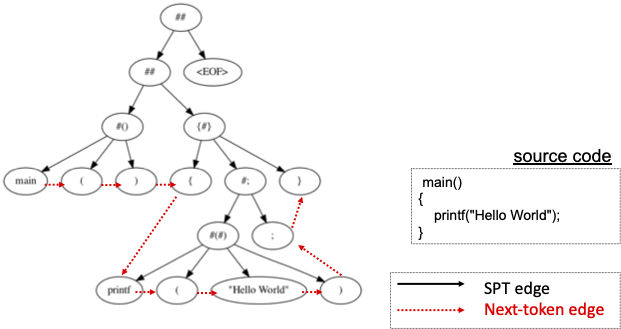

# Graph Neural Network Baseline Experiments on Project CodeNet

The goal of this project is to investigate the source code classification capabilities of standard graph neural networks (GNNs).
We use the (slightly adapted) training procedures and models provided by the Open Graph Benchmark [1] with the example experiments on source code. 
The code contains two GNNs, GCN [2] and GIN [3], including their extensions with virtual nodes.
## Example

### Graph Representation of Source Code

We transform the source code into graphs as in the picture, where the **simplified parse tree (SPT)** (see Section 6 [in the paper](./../../ProjectCodeNet.pdf)) is extended by **next-token edges**.
Each node is represented by five features: 
(1) node type (token or parsing rule); 
(2) token type (e.g., an identifier); 
(3) parsing rule type (e.g., an expression); 
(4) whether it represents a reserved word; and
(5) its depth in the tree.

Note that we actually consider the graph edges to be bi-directional at runtime in order to improve the learning capabilities of our models.

### Graph Representation Learning

**Graph neural networks (GNNs)** learn a graph representation by exploiting the graph structure as inductive bias. 
Most GNNs follow the architecture proposed in [4]. In a nutshell, they first compute a node representation for every graph node by iteratively **aggregating** its neighbor nodes and **combining** this aggregated representation with the current node representation.
Then, the node representations are **pooled** to obtain a final representation for the entire graph. 
The different models vary primarily in the way they do the aggregation, combination, and pooling.

The code contains two popular GNNs: 
the **graph convolutional network (GCN)** [2], one of the first and most common GNNs, 
and the **graph isomorphism network (GIN)** [3], which is more powerful since it pools not only the final node representations but those from all iterations. 
In addition, we provide the **option for using virtual nodes**, which means that an artificial node is added to each graph and bi-directionally connected to all graph nodes to improve the aggregation phase. 

Finally, note that you can easily integrate any graph classification model written in Pytorch Geometric. For an introduction to Pytorch Geometric, see [here](https://pytorch-geometric.readthedocs.io/en/latest/notes/introduction.html).

### The Task

In our experiments, we do program classification as follows.
Each problem in the Project Codenet benchmark is one class, 
and a code sample belongs to a class if it is a submission to the corresponding problem.
Hence, **we use the graph representation of a code sample computed by the GNN to predict its problem class**.

## Installation

Tested with Python 3.8, PyTorch 1.8.1, and PyTorch Geometric 1.6.3.
- Set up an Anaconda environment: `./setup.sh`
(before running, edit pytorch installation command and set variables; see comment in file)
- Alternatively, install the above and the packages listed in requirements.txt

## Data

The project contains a self-contained data sample directory  `small` to test the installation. Note that `small` directory contains two sub-directories `raw` and `splits/random`. The `raw` directory contains the SPT data (8 CSV files each in .gz format) and `splits/random` directory contains the training/validation/testing split files (in both CSV and its .gz format). We also published the splits files that we used in our paper [here](https://github.com/IBM/Project_CodeNet/blob/main/ProjectCodeNet_NeurIPS2021.pdf). To repeat the large scale JAVA/Python/C++ experiments as mentioned in the paper, one simply needs to download the Project CodeNet benchmark SPT datasets in graph format [here](https://developer.ibm.com/exchanges/data/all/project-codenet/) (e.g., Project_CodeNet_Java250_spts.tar.gz, which contains 8 CSV files that represent the encoding of the SPT graph) and convert each CSV file to its .gz format and put them into the corresponding data directory (e.g., data/Java250/raw) before launching the run script. Please refer to `small` directory for the file format and directory layout.  

## Experiments

* The script to run the experiments is `./run.sh`
* By default, the script will run `GCN` over `small`. To change these settings, see the comments in the script. To repeat the JAVA/Python/C++ experiments as mentioned in our paper, one just needs to put the raw data in the corresponding directory (see above) and change the `DATASET` to one of the 4 options: Java250, Python800, C++1000, and C++1400.
* You can change the dataset, data directory, and other variables in the script as needed.
* Note that we did not do hyperparamter tuning. For all our experiments, we used the parameters from the script. 
* When running the first time with a new dataset, the code will first preprocess the data. It will reuse these files with later runs.

## Results

|     | Java250 | Python800 | C++1000 | C++1400 |
| ----| --------|--------   |-------  | --------|
|    MLP w/ bag of tokens|71.87 | 67.84| 68.23 | 64.73 |
 |   CNN w/ token sequence | 90.96 | 89.49| 94.27| 94.10 |
  |  C-BERT                | 97.60| 97.30 | 93.00 | 90.00 |
   | **GCN**           | 92.70 ± 0.25 | 93.82 ± 0.16 | 95.76 ± 0.12 | 95.26 ± 0.13|
   | **GCN-V**          | 93.02 ± 0.81 | 94.30 ± 0.15 | 96.09 ± 0.17 | 95.73 ± 0.07 |
   | **GIN**          | 93.26 ± 0.23 | 94.17 ± 0.19 | 96.34 ± 0.15 | 95.95 ± 0.13 |
   | **GIN-V**           | 92.77 ± 0.66 | 94.54 ± 0.12 | 96.64 ± 0.10 | 96.36 ± 0.10 |

## References

* [1] Hu et al. [Open Graph Benchmark: Datasets for Machine Learning on Graphs](https://arxiv.org/pdf/2005.00687.pdf), NeurIPS 2020.
* [2] Kipf and Welling. [Semi-Supervised Classification with Graph Convolutional Networks](https://arxiv.org/pdf/1609.02907.pdf), ICLR 2017.
* [3] Xu et al. [How Powerful are Graph Neural Networks?](https://arxiv.org/pdf/1810.00826.pdf), ICLR 2019.
* [4] Gilmer et al. [Neural Message Passing for Quantum Chemistry](https://arxiv.org/pdf/1704.01212.pdf), ICML 2017.

Please leave an issue if you have any trouble running the code.

Author: Veronika Thost
