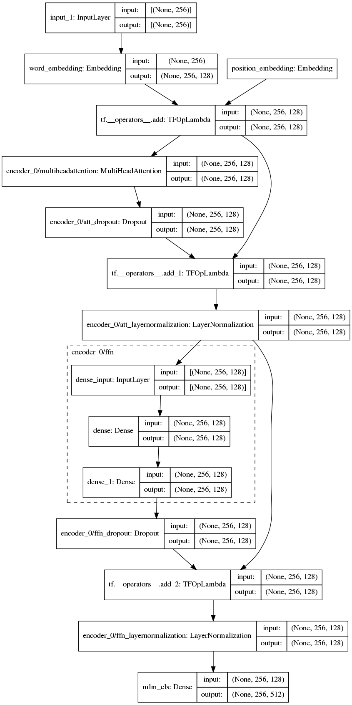

# A Masked Language Model using Keras MultiHeadAttention for CodeNet

## Introduction

This experiment investigates whether a popular attention model to
construct a masked language model (MLM) can be used for source code
instead of natural language sentences. We here closely follow the
approach by Ankur Singh documented in his
[blog](https://keras.io/examples/nlp/masked_language_modeling).

The goal of the model is to be able to infer the correct token for a
masked out token (or blank) at an arbitrary position in the source text.
We will use the special token literal `[mask]` to represent the masked
out token. We assume that in the test set precisely one token
is randomly masked per sample. The original token at that position is
then the golden label, or ground truth.

## Dataset

The CodeNet dataset consist of a large (11 million) collection of
submissions in various programming languages to problems posed on
online judging sites. The submissions are typically small, complete
programs in a single source file. There are 1000s of problems in this
dataset.

We extract a selection of C programming language files from the
CodeNet dataset for training and evaluation:

| Aspect              | Value |
| ------------------- | ----- |
| purpose             | training |
| submission status   | Accepted |
| smallest size       | 200 bytes |
| largest size        | 500 bytes |
| samples per problem | at most 100 |
| problems            | 0-3417 |
| total samples       | 50,000 |

Notice that the training and evaluation are derived from
non-overlapping sets of problems. It might also be interesting to see
what happens when a different split is made, e.g. by selecting 110
submissions from each problem and using 100 for training and the rest
for evaluation.

| Aspect              | Value |
| ------------------- |------ |
| purpose             | evaluation |
| submission status   | Accepted |
| smallest size       | 200 bytes |
| largest size        | 500 bytes |
| samples per problem | at most 100 |
| problems            | 3418-3636 |
| total samples       | 5,000 |

## Data preparation

Each C file is tokenized into a vocabulary of 414 distinct tokens:

| Type           | Count | Description |
| -------------- | ----: | -- |
|the keyword     |    95 | all C++20 reserved words |
|the function    |   279 | function names in common header files |
|the identifier  |    18 | standard identifiers, like stderr, etc. |
|the punctuator  |    15 | small set of punctuation symbols |
|# or ##         |     2 | the 2 C preprocessor symbols |
|the token class |     5 | one of: identifier, number, operator, character, string |

By _the keyword_, _the function_ and so on, we mean the actual keyword
or function literal, like `while` for a keyword and `strlen` for a function.
The tokens are output on a single line separated by spaces.
It turns out that our training set overall uses 174 out of the 414
possible tokens; not all keywords and standard functions are used presumably.

This code snippet:
```C
for (i = 0; i < strlen(s); i++) {}
```

will be converted to (wrapped here to fit on the line):
```C
for ( identifier = number ; identifier < strlen ( identifier ) ;
identifier operator ) { }
```

The tokenized source files are read into a pandas dataframe and
processed by the Keras TextVectorization layer to extract a vocabulary
and encode all token lines into vocabulary indices. Index 0 is
reserved for padding; index 1 is the `<UNK>` value for Out-Of-Vocabulary
tokens (not used in our case since the input vocabulary is of fixed
size); the last index (least frequent position) is dedicated to encode
the special `[mask]` token. Each sample will have a fixed token length
of 256. The average number of tokens per sample across the training
set is 131. Short samples are padded with 0 and too large ones are
simply truncated. The same operations will be applied to the test set.

## Model

As mentioned above, the BERT-like model is copied from the Keras
example "End-to-end Masked Language Modeling with BERT" by Ankur Singh, implemented in this [colab Python notebook](https://colab.research.google.com/github/keras-team/keras-io/blob/master/examples/nlp/ipynb/masked_language_modeling.ipynb)

The model architecture is depicted in Figure 1 below.

<!--
<p align="center">
  
</p>
-->


(Unfortunately the Keras `plot_model` function has a bug: the positional
embedding node is missing and some edges as well, in particular the `dropout`
nodes should not be leaf nodes but connect to the `add` operations as their
second operand. All this has been corrected by hand here.)

## Training

The model is trained with 50,000 samples in batches of 32 (1562
batches per epoch) over 5 epochs with a learning rate of 0.001 using the
Adam optimizer.

## Evaluation

We evaluate the trained model on a test set of 5,000 samples taken
from problems not considered for the training set. Each sample is
preprocessed in the same way as the training samples and one token
(never a padding!) is arbitrarily replaced by the `[mask]`. Then a
prediction is generated and the top 1 and top 5 results are compared
with the expected value. The achieved accuracies are:

```
top-1 accuracy: 0.9434
top-5 accuracy: 0.9986
```

# References

> <a id="1">[1]</a>
Ankur Singh,
["End-to-end Masked Language Modeling with BERT"](https://keras.io/examples/nlp/masked_language_modeling)

> <a id="2">[2]</a>
[CodeXGLUE -- Code Completion (token level)](https://github.com/microsoft/CodeXGLUE/tree/main/Code-Code/CodeCompletion-token)

> <a id="3">[3]</a>
[AllenNLP Demo on Masked Language Modeling](https://demo.allennlp.org/masked-lm)

> <a id="4">[4]</a>
Zhangyin Feng, Daya Guo, Duyu Tang, Nan Duan, Xiaocheng Feng, Ming Gong,
Linjun Shou, Bing Qin, Ting Liu, Daxin Jiang, Ming Zhou,
[CodeBERT: A Pre-Trained Model for Programming and Natural Languages](https://arxiv.org/abs/2002.08155)
