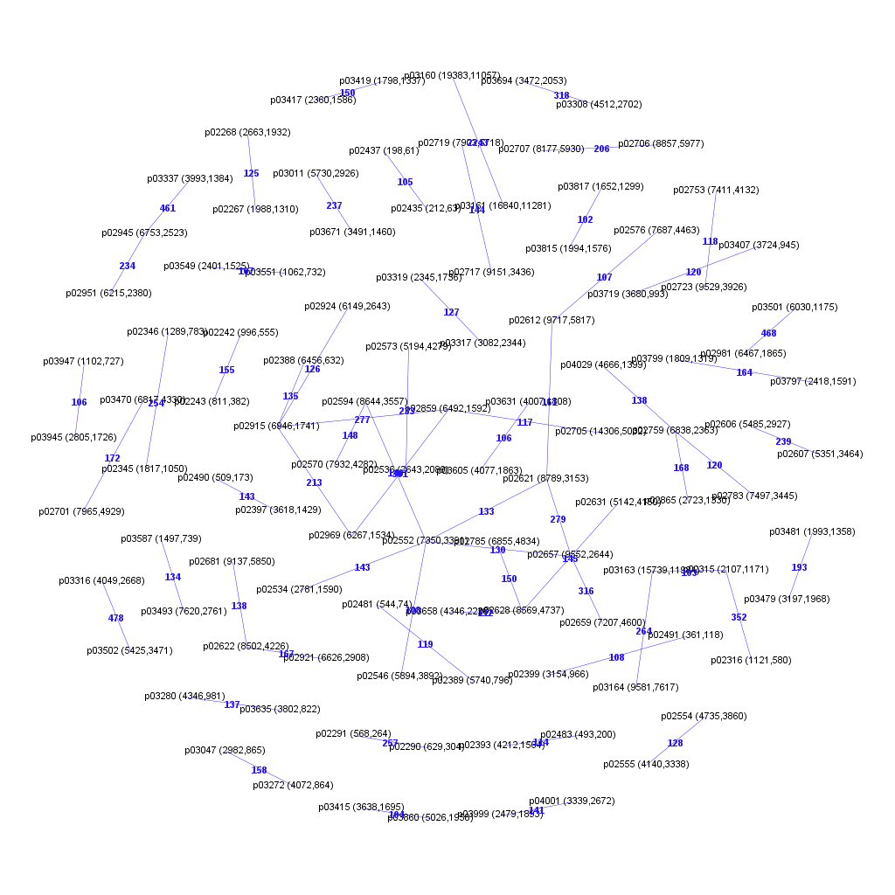
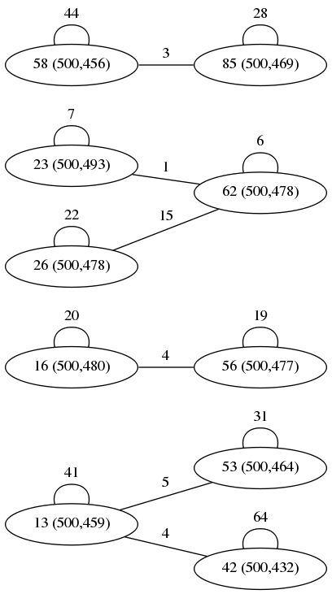

# Extracting information from the clusters file

## Introduction

The [`duplicates`](../../) program finds near-duplicates (according
several possible
similarity metrics) in tokenized source code files. Input is
a list of (file name) identifier and token list pairs and output is a clusters
file where the identifiers of near-duplicate token lists are grouped together.

Specifically, in our application, the source files are submissions to problems
and each identifier contains both a problem id as well as a submission id.
Here we discuss how these clusters can be used to derive connectivity
information among the problems.

## Assumptions & Definitions

We assume that the clusters file contains all submissions even the submissions
that were found not to be a near-duplicate with any other submission. We call
such
single-submission (or size 1) clusters _singletons_. To count the number of
submissions in the file with blank line separated clusters use this command:

```bash
$ grep -v '^$' clusters_file | wc -l
```

In the subsequent examples the Project CodeNet dataset is
under the /Volume1/AI4CODE directory, which will be different for another user.
We assume that the submissions are treated per problem and that the problems
appear in sorted order. A snippet of a few clusters will make this clear:

```console
/Volume1/AI4CODE/Project_CodeNet/data/p00000/C++/s667847559.cpp:

/Volume1/AI4CODE/Project_CodeNet/data/p00000/C++/s160425098.cpp:
/Volume1/AI4CODE/Project_CodeNet/data/p00000/C++/s079271556.cpp:  1.00, 1.00
/Volume1/AI4CODE/Project_CodeNet/data/p00000/C++/s203527521.cpp:  1.00, 0.97
/Volume1/AI4CODE/Project_CodeNet/data/p00000/C++/s659323087.cpp:  0.92, 0.95

/Volume1/AI4CODE/Project_CodeNet/data/p00000/C++/s863134661.cpp:
/Volume1/AI4CODE/Project_CodeNet/data/p00001/C++/s582642417.cpp:  0.92, 0.93
/Volume1/AI4CODE/Project_CodeNet/data/p02388/C++/s372565527.cpp:  0.94, 0.95
/Volume1/AI4CODE/Project_CodeNet/data/p02389/C++/s400444407.cpp:  0.94, 0.94
/Volume1/AI4CODE/Project_CodeNet/data/p04011/C++/s527916222.cpp:  0.92, 0.90
/Volume1/AI4CODE/Project_CodeNet/data/p04029/C++/s641704781.cpp:  0.92, 0.92
```

Here we see 3 clusters all related to problem `p00000`, the first a singleton
one, the second happens to list only some near-duplicates within the same
problem (viz. `p00000`) and the third shows near-duplicates across problems.

So a cluster is a number of submissions (identifiers a.k.a. file names)
delimited by blank lines. A cluster can be of size 1 and then it is a
singleton, otherwise we call it a true cluster. The first submission of a
cluster is called its representative, all others (if any) are called members.
A singleton cluster has a representative but no members.

## Computing specific counts in clusters

Clusters are processed in the order as they appear in the clusters file.
Because of the assumed problem order, we will see all clusters with
representatives
of a given problem first, before we see any clusters of a next problem.
If problems are named like `p00000`, `p00001`, `p00002`, etc. then we know
that all problems mentioned in a cluster can never be _less than_ the problem
of the representative.

In the following we will select some problem as our point of reference and
call it the current problem under treatment. We start treating the current
problem as soon as we see the first cluster that has a submission of the
current problem as representative. When subsequently
we see a cluster with a different (larger) problem id, then that becomes the
new current problem.
Note that treatment of the last problem will never reveal any new
near-duplicates with another problem.

To compute the number of singletons for the current problem simply means to
count the size 1 clusters; all clusters for a given problem occur together
(because of the ordering assumption). Of course computing the number of true
clusters can be done in the same way. However, to compute the number of
submissions we have to realize that some mentions of submissions of the
current problem could have happened in clusters of previous (but not later!)
problems. Obviously for the first problem no submissions can occur as member
of a (non-existing) previous problem.
In general there are 4 (mutually exclusive) cases of where to find submissions
of a given problem. To make things concrete, assume we focus on problem
`p00035` as our current problem.

1. A current problem submission (`s551060303` in the example) was mentioned,
   i.e., appears as a member, in a cluster of an earlier other problem (in the
   example: `p00010`), but of course not as representative.  
   Example:  
```
    /Volume1/AI4CODE/Project_CodeNet/data/p00010/C++/s499660528.cpp:
    /Volume1/AI4CODE/Project_CodeNet/data/p00023/C++/s703312331.cpp:  0.94, 0.91
    /Volume1/AI4CODE/Project_CodeNet/data/p00035/C++/s551060303.cpp:  0.93, 0.89
```
2. A current problem submission (`s427629428`) forms a singleton.  
   Example:  
```
    /Volume1/AI4CODE/Project_CodeNet/data/p00035/C++/s427629428.cpp:
```
3. A current problem submission (`s401442699`) is the representative of a
   true cluster.  
   Example:  
```
    /Volume1/AI4CODE/Project_CodeNet/data/p00035/C++/s401442699.cpp:
    /Volume1/AI4CODE/Project_CodeNet/data/p00035/C++/s523744990.cpp:  1.00, 1.00
    /Volume1/AI4CODE/Project_CodeNet/data/p00035/C++/s008056583.cpp:  0.98, 0.99
    /Volume1/AI4CODE/Project_CodeNet/data/p00035/C++/s532713839.cpp:  1.00, 1.00
```
4. A current problem submission (`s670450979`) appears as member in a cluster
   whose representative is of the current problem (this then must also be a
   true cluster).  
   Example:  
```
    /Volume1/AI4CODE/Project_CodeNet/data/p00035/C++/s255617503.cpp:
    /Volume1/AI4CODE/Project_CodeNet/data/p00035/C++/s670450979.cpp:  1.00, 1.00
```

Cases 2), 3) and 4) can be computed on-the-fly when working on the current
problem (when we see all its clusters). Case 1) requires us to store a count
per problem of its submissions seen before we actually start treating the
current problem. As required, the sum over all 4 cases equals to number of
submissions for the current problem.
The sum of the cases 3) and 4) constitutes the
intra-problem near-duplicates. Each of these submissions, all belonging to the
same problem, are found similar. Note that case 1) represents the
inter-problem similarities.

While processing all true clusters of the current problem we count for each
other problem how many of its submissions occur. For instance in these two
clusters of `p00035` we count 2 submissions for `p00068` and 1 submission each
for the other mentioned problems. We will call this the multiplicity of the
problem.

```
/Volume1/AI4CODE/Project_CodeNet/data/p00035/C++/s107287197.cpp:
/Volume1/AI4CODE/Project_CodeNet/data/p00068/C++/s686864771.cpp:  0.95, 0.94
/Volume1/AI4CODE/Project_CodeNet/data/p02300/C++/s391626263.cpp:  0.92, 0.91

/Volume1/AI4CODE/Project_CodeNet/data/p00035/C++/s856080806.cpp:
/Volume1/AI4CODE/Project_CodeNet/data/p00058/C++/s808805220.cpp:  0.97, 0.93
/Volume1/AI4CODE/Project_CodeNet/data/p00068/C++/s382614394.cpp:  0.98, 0.94
/Volume1/AI4CODE/Project_CodeNet/data/p00081/C++/s732191557.cpp:  0.94, 0.94
```

Another interesting number is to count in how many clusters of the current
problem a given other problem is mentioned, like knowing that the 2 mentions
of `p00068` came from 2 different clusters. For the current problem we simply
record its number of clusters (singletons inclusive). We will call this the
cluster count. Notice that the cluster count can never be greater than the
multiplicity (except for the current problem entry).

## Preparing the adjacency list output

We present the information (numbers of submissions, number of singletons,
number of inter-problem mentions, cluster count) extracted from the clusters
file as an adjacency list of problems: each problem records some problem
specific data followed by a list of the problems that it relates to in terms
of the cluster information.

In particular we choose to output a problem per line, starting with the
current problem id (like `p00000`) followed by the number of submissions
and the number of singleton clusters. Next is a list of _connected_ (or
neighboring) problems (the current problem itself among them) that are
mentioned in the current problem clusters each with their cluster count and
multiplicity. To be precise, the entry for the current problem states the
number of clusters and the number of its submissions that appear in true
clusters; the entries of other problems state their cluster count (relative to
the current problem) and the number of their submissions that are
near-duplicates of some submission of the current problem (multiplicity).

Here is an excerpt from a typical output:

```console
...
p00023 512 370 p00023 419 130 p02297 1 1 p02292 1 1 p02291 1 1 p02290 1 1
p00024 546 446 p00024 485 97
p00025 674 462 p00025 523 210 p03149 1 1 p03130 1 1 p00445 1 1
p00026 503 435 p00026 464 68
p00027 591 523 p00027 551 68 p01137 1 1 p00125 1 2 p01143 1 2 p01140 1 1
p00028 655 551 p00095 1 1 p00028 594 102 p00434 1 1 p00032 1 1
...
p00035 359 283 p00081 1 1 p00068 2 2 p00129 1 1 p00059 1 1 p00058 3 3 \
       p02300 2 2 p00035 309 62
```
We see that problem `p00023` has a total of 512 submissions, 370 of which are
singletons, 419 clusters, and 130 submissions are intra-problem
clustered. This leaves 512-370-130=12 submissions that are near-duplicates of
other problems mentioned before. Also, `p00023` has submissions that are a
near-duplicate of a submission of the 4 other listed problems. (The identity
of these submissions has been lost by the aggregation per problem.)
The problems `p00024` and `p00026` do not relate to any subsequent
problems, but might have relations with previous problems. Indeed for
`p00024` we find 546-446-97=3; though `p00026` has no near-duplicates with any
other problem because 503-435-68=0. It has 68 intra-problem duplicates.
For problem `p00027` we see a case where there are 2 `p00125` submissions that
are mentioned in only 1 cluster.
Our earlier example problem `p00035` is seen to have 359 total, 283
singleton and 62 intra-problem submissions; leaves 14 inter-problem ones.

## Directed graph

The adjacency output can be considered as a directed graph.
The line for each problem defines a node and its edges.
The node is the current problem of the line. It has directed edges to all the
neighboring problems/nodes on the line. Each edge is annotated with the
multiplicity (the second number of the neighbor node).
We call this the edge weight.

For each node we now find that the sum of the self-edge weight and all the
incoming edge weights equals the difference of total submissions and singletons.

## Undirected graph

With all the information about the number of near-duplicate submissions shared
among problems, it should be possible to construct an undirected graph where
the edge weight is a measure for the 'similarity' between problems. How can we
reasonable define such a 'similarity' measure?

Of all the clusters for a given problem, we are only interested in the true
ones that have members with submissions of other problems. Let's analyze what
those mean. Consider the submissions of two distinct problems pi and pj.
We know all the clusters with a pi submission as representative and one or
more pj submissions as member. Note that all submissions are distinct.
There are no other clusters that mention pi and pj near-duplicates.
The total number of pj member submissions is the multiplicity entry in the
adjacency list of pi.
So we know from pj's perspective how great the 'similarity' with pi is.
But this could all be due to a single submission of pi or maybe 1-for-1 with
pj, or any number in between which is precisely the cluster number.

A satisfying, symmetric weight would be the
number of pairs of pi and pj submissions with all pi's and pj's distinct.
We find this to be the minimum of cluster count and multiplicity.
This minimum is equal to the cluster count.

We can model the relation between the submissions of two problems as a
bipartite graph. On the left the pi cluster representatives and on the right
the pj member submissions. The cluster count gives the number of nodes on the
left-hand side that have incident edges; the multiplicity gives the number of
nodes on the right-hand side that have an incident edge (note can at most have
1 edge per node on the right-hand side).

## Experiment

The figure below is the result of finding the near-duplicates in all
4,353,049 Accepted C++ programs of the 4053 Project CodeNet problems excluding a set
of 71,802 outlier submissions. The clusters are
processed as sketched above and only connections with a weight larger than 100
are kept. This gives a graph of 104 nodes and 64 edges. The suspicion that
heavily weighted edges connect very similar problems is confirmed by looking
at the HTML program descriptions. For instance we find problems `p02315` and
`p02316` and also the pair `p03160` and `p03161` to be identical. Other pairs
might exist.



Likewise we can analyze the POJ-104 dataset which contains 104 problems with
500 C/C++ submissions each. Below, the graph shows all 10 problems that have
cross near-duplicates.


