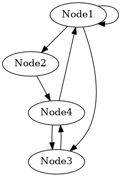
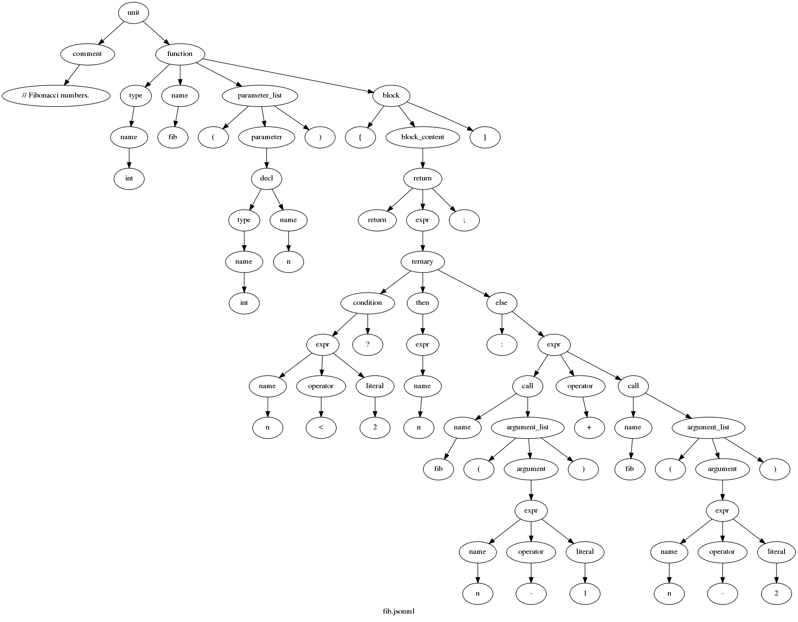

# IBM AI4Code JSON-Graph Tools

## Introduction

This is a collection of small utility programs written in C to manipulate
[IBM AI4Code JSON-Graph](../README.md) nodelist format files.
For now, 3 programs are offered:

1. `jgf2dot` converts a graph or tree to the
   [GraphViz dot input format](https://graphviz.org/doc/info/lang.html); and

2. `jgf2spt` converts a tree (!) to the [Aroma SPT JSON](https://github.com/facebookresearch/aroma-paper-artifacts/blob/master/reference/data/example_query.json) format.

3. `jsonml2jgf` accepts any JsonML as input and represents its tree structure
   as a JSON-Graph. Alternatively, it can interpret the leaf nodes as tokens
   and output those.

The programs use a [third-party JSON parser](https://github.com/zserge/jsmn)
that produces an array of tokens from an input character array. The expected
schema is hard-coded into the program logic.

## Usage

```bash
$ jgf2dot digraph.json > digraph.dot

# or use in a pipe:

$ cat digraph.json | jgf2dot > digraph.dot

# or directly generate a PNG file:

$ jgf2dot digraph.json | dot -Tpng > digraph.png

# same for jgf2spt:

$ jgf2spt tree.json > tree.spt
```

## Restrictions

The input is assumed to be valid JSON and moreover must comply with the [IBM
AI4Code JSON-Graph schema](../graph-schema.json).
All checks immediately cause a program exit upon error.

Notice that the whole input will be loaded into memory before parsing starts.
The approach is to first construct a graph from the input and
afterwards traverse the graph to produce the output.
Here is an example JSON file:

```json
{
  "graph": {
    "version": "1.0",
    "directed": true,
    "nodes": [
      { "id": "Node1" },
      { "id": "Node2" },
      { "id": "Node3" },
      { "id": "Node4" }
    ],
    "edges": [
      { "between": [ "Node1", "Node1" ] },
      { "between": [ "Node1", "Node2" ] },
      { "between": [ "Node1", "Node3" ] },
      { "between": [ "Node2", "Node4" ] },
      { "between": [ "Node3", "Node4" ] },
      { "between": [ "Node4", "Node3" ] },
      { "between": [ "Node4", "Node1" ] }
    ]
  }
}
```

The PNG image produced by dot via jgf2dot from this JSON input looks like
this:



## Create parse tree and token stream with `srcML`

The `jsonml2jgf` utility reads a JsonML file. [JsonML](http://www.jsonml.org/)
is the JSON Markup Language meant to losslessly convert between XML and JSON.
Any XML document can hence be converted to JsonML and back without loss of
information.

[srcML](https://www.srcml.org) is a tool for the analysis of programming
language source code and it presents its results in the form of an XML
annotated source code. `srcML` supports the programming languages C, C++, C#,
and Java.

To convert XML to JsonML we use the
[`xml-to-jsonml`](https://github.com/bramstein/xsltjson/blob/master/conf/xml-to-jsonml.xsl)
XSLT script that can be processed with e.g. `xsltproc`.

Summarizing, the work flow looks as follows:

```console
srcml --position source.c | xml-to-jsonml - | jsonml2jgf
```

The normal operation of `jsonml2jgf` is to produce a tree in JSON-Graph
format. The tree faithfully represents the structure of the JsonML input and
hence the structure of the XML elements (with associated attributes).
The tree can then be visualized via `jgf2dot` with GraphViz dot.

The program can be switched to output a token stream instead with the `-t`
command line option. The full option set is:

```console
$ jsonml2jgf -h
Reads a JsonML file and constructs a JSON-Graph from its tree structure.
If the JsonML represents a (abstract) syntax tree, e.g. generated by scrML
then this program can also output a token stream instead.

usage: jsonml2jgf [ -cdho:stvw ] [ FILE ]

Command line options are:
-c       : keep comments in the token output stream.
-d       : print debug info to stderr; implies -v.
-h       : print just this text to stderr and stop.
-o<file> : name for output file (instead of stdout).
-s       : enable a special start token specifying the filename.
-t       : output the tokens instead of a graph.
-v       : print action summary to stderr.
-w       : suppress all warning messages.
```

### Example

Let's take the tools for a ride. Starting with a small C program, here are all
the intermediate and end results of the work flow:

```C
// Fibonacci numbers.
int fib(int n)
{
  return n < 2 ? n : fib(n-1) + fib(n-2);
}
```

The generated XML does not look pretty. It is easily beautified with `tidy
-xml -i -q`.

```bash
$ srcml --position fib.c | tee fib.xml
<?xml version="1.0" encoding="UTF-8" standalone="yes"?>
<unit xmlns="http://www.srcML.org/srcML/src" xmlns:pos="http://www.srcML.org/srcML/position" revision="1.0.0" language="C" filename="fib.c" pos:tabs="8"><comment type="line" pos:start="1:1" pos:end="1:21">// Fibonacci numbers.</comment>
<function pos:start="2:1" pos:end="5:1"><type pos:start="2:1" pos:end="2:3"><name pos:start="2:1" pos:end="2:3">int</name></type> <name pos:start="2:5" pos:end="2:7">fib</name><parameter_list pos:start="2:8" pos:end="2:14">(<parameter pos:start="2:9" pos:end="2:13"><decl pos:start="2:9" pos:end="2:13"><type pos:start="2:9" pos:end="2:11"><name pos:start="2:9" pos:end="2:11">int</name></type> <name pos:start="2:13" pos:end="2:13">n</name></decl></parameter>)</parameter_list>
<block pos:start="3:1" pos:end="5:1">{<block_content pos:start="4:3" pos:end="4:41">
  <return pos:start="4:3" pos:end="4:41">return <expr pos:start="4:10" pos:end="4:40"><ternary pos:start="4:10" pos:end="4:40"><condition pos:start="4:10" pos:end="4:16"><expr pos:start="4:10" pos:end="4:14"><name pos:start="4:10" pos:end="4:10">n</name> <operator pos:start="4:12" pos:end="4:12">&lt;</operator> <literal type="number" pos:start="4:14" pos:end="4:14">2</literal></expr> ?</condition><then pos:start="4:18" pos:end="4:18"> <expr pos:start="4:18" pos:end="4:18"><name pos:start="4:18" pos:end="4:18">n</name></expr> </then><else pos:start="4:20" pos:end="4:40">: <expr pos:start="4:22" pos:end="4:40"><call pos:start="4:22" pos:end="4:29"><name pos:start="4:22" pos:end="4:24">fib</name><argument_list pos:start="4:25" pos:end="4:29">(<argument pos:start="4:26" pos:end="4:28"><expr pos:start="4:26" pos:end="4:28"><name pos:start="4:26" pos:end="4:26">n</name><operator pos:start="4:27" pos:end="4:27">-</operator><literal type="number" pos:start="4:28" pos:end="4:28">1</literal></expr></argument>)</argument_list></call> <operator pos:start="4:31" pos:end="4:31">+</operator> <call pos:start="4:33" pos:end="4:40"><name pos:start="4:33" pos:end="4:35">fib</name><argument_list pos:start="4:36" pos:end="4:40">(<argument pos:start="4:37" pos:end="4:39"><expr pos:start="4:37" pos:end="4:39"><name pos:start="4:37" pos:end="4:37">n</name><operator pos:start="4:38" pos:end="4:38">-</operator><literal type="number" pos:start="4:39" pos:end="4:39">2</literal></expr></argument>)</argument_list></call></expr></else></ternary></expr>;</return>
</block_content>}</block></function>
</unit>
```

Next step, convert the XML to JsonML. Again, the output is unformatted JSON
and does not look great. If so desired run through `jq .` to get a
pretty-printed output.

```bash
$ xml-to-jsonml fib.xml | tee fib.jsonml
["unit",{"revision":"1.0.0","language":"C","filename":"fib.c","pos:tabs":8},["comment",{"type":"line","pos:start":"1:1","pos:end":"1:21"},"// Fibonacci numbers."],["function",{"pos:start":"2:1","pos:end":"5:1"},["type",{"pos:start":"2:1","pos:end":"2:3"},["name",{"pos:start":"2:1","pos:end":"2:3"},"int"]],["name",{"pos:start":"2:5","pos:end":"2:7"},"fib"],["parameter_list",{"pos:start":"2:8","pos:end":"2:14"},"(",["parameter",{"pos:start":"2:9","pos:end":"2:13"},["decl",{"pos:start":"2:9","pos:end":"2:13"},["type",{"pos:start":"2:9","pos:end":"2:11"},["name",{"pos:start":"2:9","pos:end":"2:11"},"int"]],["name",{"pos:start":"2:13","pos:end":"2:13"},"n"]]],")"],["block",{"pos:start":"3:1","pos:end":"5:1"},"{",["block_content",{"pos:start":"4:3","pos:end":"4:41"},["return",{"pos:start":"4:3","pos:end":"4:41"},"return ",["expr",{"pos:start":"4:10","pos:end":"4:40"},["ternary",{"pos:start":"4:10","pos:end":"4:40"},["condition",{"pos:start":"4:10","pos:end":"4:16"},["expr",{"pos:start":"4:10","pos:end":"4:14"},["name",{"pos:start":"4:10","pos:end":"4:10"},"n"],["operator",{"pos:start":"4:12","pos:end":"4:12"},"<"],["literal",{"type":"number","pos:start":"4:14","pos:end":"4:14"},2]],"
?"],["then",{"pos:start":"4:18","pos:end":"4:18"},["expr",{"pos:start":"4:18","pos:end":"4:18"},["name",{"pos:start":"4:18","pos:end":"4:18"},"n"]]],["else",{"pos:start":"4:20","pos:end":"4:40"},": ",["expr",{"pos:start":"4:22","pos:end":"4:40"},["call",{"pos:start":"4:22","pos:end":"4:29"},["name",{"pos:start":"4:22","pos:end":"4:24"},"fib"],["argument_list",{"pos:start":"4:25","pos:end":"4:29"},"(",["argument",{"pos:start":"4:26","pos:end":"4:28"},["expr",{"pos:start":"4:26","pos:end":"4:28"},["name",{"pos:start":"4:26","pos:end":"4:26"},"n"],["operator",{"pos:start":"4:27","pos:end":"4:27"},"-"],["literal",{"type":"number","pos:start":"4:28","pos:end":"4:28"},1]]],")"]],["operator",{"pos:start":"4:31","pos:end":"4:31"},"+"],["call",{"pos:start":"4:33","pos:end":"4:40"},["name",{"pos:start":"4:33","pos:end":"4:35"},"fib"],["argument_list",{"pos:start":"4:36","pos:end":"4:40"},"(",["argument",{"pos:start":"4:37","pos:end":"4:39"},["expr",{"pos:start":"4:37","pos:end":"4:39"},["name",{"pos:start":"4:37","pos:end":"4:37"},"n"],["operator",{"pos:start":"4:38","pos:end":"4:38"},"-"],["literal",{"type":"number","pos:start":"4:39","pos:end":"4:39"},2]]],")"]]]]]],";"]],"}"]]]
```

Finally `jsonml2jgf` comes into play. Let's first get a nice picture of the
parse tree. We skip showing the intermediate JSON-Graph output which should be
well-known by now.

```bash
$ jsonml2jgf fib.jsonml | jgf2dot | dot -Tpng -o fib.png
```



### Token stream

The tokens of the input `fib.c` program are of course available as leaf nodes
in the parse tree. It is useful to have them (in order of occurrence of
course) as a separate output stream. For now there is a simple switch: use
`-t` to have the tokens output instead of the tree.

Finishing our example, here is a complete token stream for `fib.c` with
preprocessor directives and comments removed:

```bash
$ jsonml2jgf -t fib.jsonml
2,0,type,int
2,4,function,fib
2,7,operator,(
2,8,type,int
2,12,decl,n
2,13,operator,)
3,0,operator,{
4,2,keyword,return
4,9,expr,n
4,11,operator,<
4,13,number,2
4,14,operator,?
4,17,expr,n
4,19,operator,:
4,21,call,fib
4,24,operator,(
4,25,expr,n
4,26,operator,-
4,27,number,1
4,28,operator,)
4,30,operator,+
4,32,call,fib
4,35,operator,(
4,36,expr,n
4,37,operator,-
4,38,number,2
4,39,operator,)
4,39,keyword,;
4,39,operator,}
```

Notice that lines are counted from 1 and columns from 0 (Emacs style).
This output is valid CSV, a header could be:

```console
line,column,class,token
```

The possible token classes and their meaning are listed in the following
table. For now this is C oriented. For C++, Java and C# this has to be reviewed
and updated.

Class     | Meaning | Example
----------|---------|--------
filename  | this is optional; use `-s` | -
comment   | this is optional; use `-c` | `/* A comment */`
keyword   | reserved word | `while`
string    | a double-quoted string literal | `"Hello"`
character | a single character literal | `'A'`
number    | any integer or floating-point number | `0.31415e+1`
operator  | any operator or punctuator symbol | `;`

Identifiers are used for many purposes and hence will be precisely classified
as to their role in the program:

Class    | Purpose of identifier | Example
---------|-----------------------|--------
decl     | variable declaration | `int`_`var`_`;`
name     | variable usage | same as expr?
expr     | variable usage | _`var`_`+ 1`
function | name definition | `void`_`fun`_`(int x)`
call     | a function by name | _`fun`_`(3)`
typedef  | name definition | `typedef int`_`MyInt`_`;`
type     | usage of type name | _`MyInt`_`i;`
struct   | name definition | `struct`_`Point`_`{}`
union    | name definition | `union`_`Variant`_`{}`
enum     | name definition | `enum`_`Color`_`{}`
label    | name definition | _`target`_`:`
goto     | label name | `goto`_`target`_`;`
